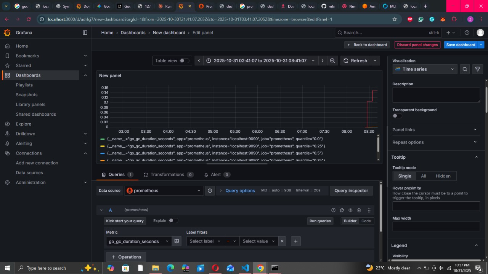
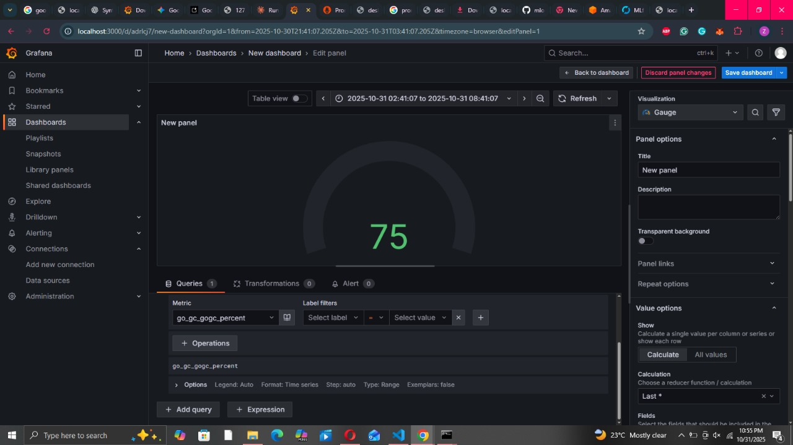
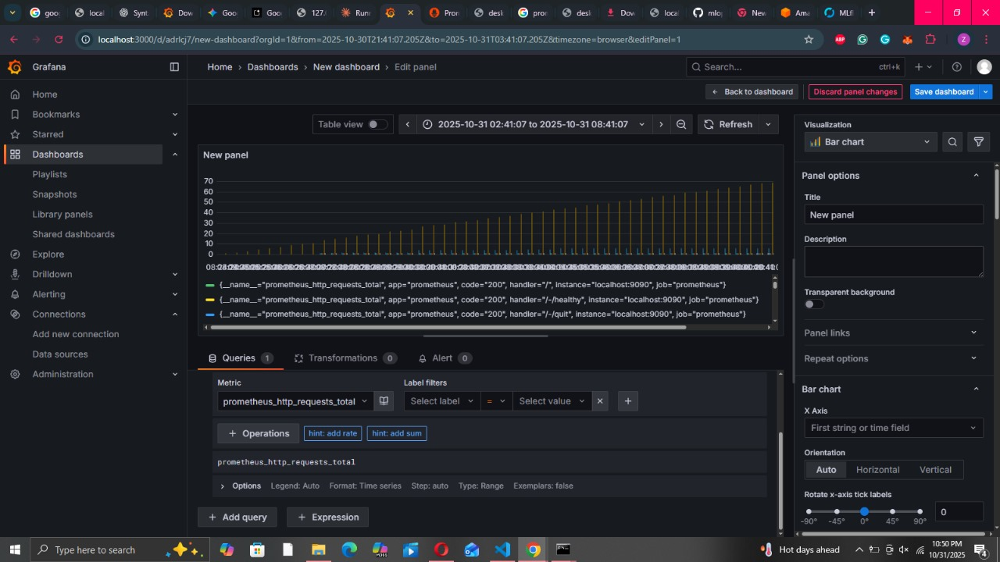
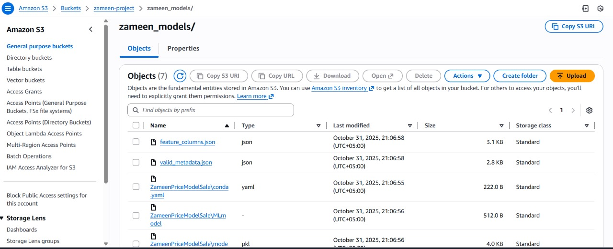

# Zameen MLOps

One-line pitch: A reproducible end-to-end MLOps stack for Zameen property price prediction — training, model registry (MLflow), monitoring, and a FastAPI inference service with a React frontend.

---

## Architecture (Data → Training → Inference)

Notes: the repo contains a backend/ FastAPI service, frontend/ React app (Vite), and local MLflow artifacts under mlruns/.

---

## Quick start (local / development)

Prerequisites

- Git
- Docker & Docker Compose (recommended)
- Python 3.10+ (if running services locally without Docker)
- Node.js 18+ (for frontend)

Clone and go to project

powershell
git clone https://github.com/AshalIbrahim/mlops.git
cd mlops

Option A — Run everything with Docker Compose (recommended)

powershell
docker-compose up --build
# This starts backend (8000), frontend (5173), and mlflow server (5000)

Option B — Run services locally (PowerShell examples)

# 1) Python environment
powershell
python -m venv .venv; .\.venv\Scripts\Activate.ps1
pip install -r requirements.txt
pip install mlflow

# 2) Start MLflow server (local tracking + artifact root uses ./mlruns)
powershell
mlflow server --backend-store-uri sqlite:///mlflow.db `
	--default-artifact-root "file:./mlruns" `
	--host 127.0.0.1 --port 5000
# If `mlflow` is not found, run `pip install mlflow` inside the activated venv

# 3) Backend (FastAPI)
powershell
cd backend
uvicorn app:app --host 0.0.0.0 --port 8000 --reload

# 4) Frontend
powershell
cd frontend
npm install
npm run dev

Environment variables (examples)

- MLFLOW_TRACKING_URI — default in repo: http://127.0.0.1:5000 (or Docker: http://mlflow:5000)
- DATABASE_URL / MySQL connection: repo uses local MySQL settings in backend/app.py (host=localhost, user=root, password=1234, database=zameen)

---

## Development Commands

This project provides two ways to run development commands:

### For Windows Users

Use the provided dev.bat script (no Make required):
powershell
# Start all services
.\dev.bat dev

# Run tests
.\dev.bat test

# Set up environment
.\dev.bat setup

# See all commands
.\dev.bat help

### For Unix/Linux or Windows with Make

If you have Make installed, use the following targets:

### Core Development Tasks

bash
make dev              # Start all services with Docker Compose
make dev-local        # Start services locally without Docker
make test            # Run tests with coverage reports
make lint            # Run code quality checks (ruff + black)

### Extended Development Targets

- make dev — Starts the full stack (backend, frontend, MLflow) using Docker Compose
- make dev-local — Runs services locally (useful for development):
  - Starts MLflow server (port 5000)
  - Launches FastAPI backend (port 8000)
  - Starts React frontend (port 5173)

### Testing & Quality

- make test — Runs pytest with coverage:
  - Generates HTML coverage report
  - Shows missing lines in terminal
  - Fails if coverage is below threshold
- make test-watch — Runs tests in watch mode (auto-reruns on file changes)
- make lint — Runs all code quality checks:
  - ruff for fast Python linting
  - black for code formatting verification
- make format — Auto-formats code with black

### Docker Operations

- make docker — Builds all Docker images
- make docker-prune — Cleans up Docker resources:
  - Removes containers and networks
  - Prunes unused images

### Cleanup & Maintenance

- make clean — Deep clean of project:
  - Removes Python cache files
  - Clears test/coverage reports
  - Prunes Docker resources
  - Removes MLflow database

### Setup & Dependencies

- make setup — Prepares development environment:
  - Creates Python virtual environment
  - Installs project dependencies
  - Adds development tools (pytest, ruff, black)

View all available targets:
bash
make help

Example development workflow:
bash
# 1. Initial setup
make setup

# 2. Start services (choose one)
make dev          # Using Docker
# or
make dev-local    # Without Docker

# 3. Run tests while developing
make test-watch

# 4. Check code quality before commit
make lint
make test

# 5. Clean up when done
make clean

Note: The Makefile uses PowerShell commands for Windows compatibility. For Unix systems, adjust the path separators and activation commands as needed.

---

## FAQ / Troubleshooting

- Problem: mlflow : The term 'mlflow' is not recognized ...
	- Cause: mlflow is not installed into the active Python environment or you are not running inside the venv.
	- Fix: Activate the venv and pip install mlflow, or run MLflow inside Docker (docker-compose starts mlflow automatically).

- Backend cannot load model (500 error):
	- Confirm MLFLOW_TRACKING_URI is reachable and the MLflow server is running at that URI.
	- Check mlruns/ and the registry for the model name ZameenPriceModelV2 (the backend expects that name by default).

- Database connection errors:
	- The backend assumes a local MySQL server (host=localhost, user=root, password=1234). Update backend/app.py or set env vars to match your DB credentials.

Windows-specific tips

- Use PowerShell with an activated venv: python -m venv .venv; .\.venv\Scripts\Activate.bat.
- If using WSL2, run Docker and commands inside the Linux subsystem for fewer permission issues.

---

## ML workflow & Monitoring

- MLflow Tracking URI (local): http://127.0.0.1:5000 (or in Docker compose: http://mlflow:5000). The repo stores artifacts locally in ./mlruns/.
- Registered model(s) in this repo: ZameenPriceModel, ZameenPriceModelV2 (backend uses ZameenPriceModelV2 by default).

Model registry note

The backend loads the model by models:/ URI:

py
model_uri = "models:/ZameenPriceModelV2/Production"

If the models:/ registry approach fails, the backend falls back to downloading artifacts from the run and loading the model artifact directly.

Evidently (data drift)

- The project references an Evidently dashboard — run it locally and point to the stored metrics or configure it with the model's reference dataset. Example: Evidently dashboard at http://localhost:7000.

Prometheus + Grafana

- Suggested metrics to collect:
	- Request latencies (FastAPI middleware)
	- Prediction counts and error rates
	- Model inference time
	- Resource utilization (CPU / memory)

- You can run Prometheus + Grafana in Docker and import panels that query the FastAPI /metrics endpoint (or use an exporter).

Screenshot / dashboard links

- Local dashboards are available after you run the monitoring stack. (Include screenshots in this repo under docs/ if available.)

---

## API documentation (FastAPI)

- The backend is a FastAPI app (see backend/app.py) and exposes auto-generated docs at http://localhost:8000/docs.

Endpoints (selected)

- GET / — health
- GET /listings — sample property listings (query limit)
- GET /locations — available locations (used by frontend)
- POST /predict — predict property price

Prediction JSON schema (request)

json
{
	"coveredArea": 1200.0,
	"beds": 3,
	"bathrooms": 2,
	"location": "Gulberg",
	"propType": "House",
	"purpose": "sale"
}

Example cURL (PowerShell / curl)

powershell
curl -X POST "http://localhost:8000/predict" -H "Content-Type: application/json" -d '{"coveredArea":1200,"beds":3,"bathrooms":2,"location":"Gulberg","propType":"House","purpose":"sale"}'

Example response

json
{
	"prediction": 12500000.0,
	"formatted_price": "PKR 12,500,000.00"
}

Notes: field names follow the PredictionInput Pydantic model in backend/app.py.

---

## Cloud Integration — ☁ Cloud Deployment
Service,Purpose,Rationale
AWS RDS (MySQL),Data Persistence. Stores the structured training data and application state.,"Used for its reliability, scalability, and managed service offering for a robust MySQL database."
AWS S3,"Artifact and Model Storage. Stores MLflow tracking files, experiment data, and finalized model binaries.","Used for its durability and high availability for storing large, immutable files generated"

Placing artifacts and updating your README.md involves using Markdown and standard image/file linking, combined with clear explanations.

Here are the brief instructions for each part:

🖼 a. Annotated Screenshots in README.md
To add screenshots, you first host the image files (e.g., as .png or .jpg) in your repository (a common folder is images/ or screenshots/). Then, use the Markdown image syntax:

Markdown

### 🚀 Running Services Overview

Below are annotated screenshots verifying the running services:

1.  *Web Service Running on Port 8080*
    
    Annotation: Shows the web application responding successfully, typically via a browser or terminal output.

2.  *Database Connection Status*
    
    Annotation: Displays the successful connection and a sample query output from the running MySQL RDS instance.
☁ b. Cloud Deployment Subsection
Create a new section in your README.md to cover the deployment details.

Cloud Deployment
This project utilizes the following cloud services to manage the machine learning (ML) workflow:

1. Services Used and Why
Service	Purpose	Rationale
AWS RDS (MySQL)	Data Persistence. Stores the structured training data and application state.	Used for its reliability, scalability, and managed service offering for a robust MySQL database.
AWS S3	Artifact and Model Storage. Stores MLflow tracking files, experiment data, and finalized model binaries.	Used for its durability and high availability for storing large, immutable files generated during the ML lifecycle.

Export to Sheets

3. ML Workflow Interaction
The ML workflow interacts with the cloud services at three main stages:

Data (D): Initial training data is loaded into the AWS RDS (MySQL) database via an ingestion script. The application reads this data from RDS for training preparation.

Training (T): The ML training script uses MLflow for experiment tracking. All generated MLflow artifact files (metrics, parameters, and model pickles) are automatically stored in the designated AWS S3 bucket.

Inference (I): The deployed application service retrieves the trained model artifact from AWS S3 during startup. It then uses new input data from the application, stores it in AWS RDS, and uses the S

---

## Security & Compliance

- LICENSE: this repository currently does not include a LICENSE file. Add a license (MIT / Apache-2.0) at the repo root. Example: LICENSE (MIT).
- CODE_OF_CONDUCT.md: not found — consider adding one to clarify community expectations.

Dependency scanning

- Recommended: run pip-audit in CI. Example:

powershell
pip install pip-audit
pip-audit

- Configure CI to fail on Critical CVEs (example in CI script).

---

---

## Files of interest

- backend/app.py — FastAPI service and MLflow model loader (uses model ZameenPriceModelV2 by default)
- frontend/ — React app (Vite)
- docker-compose.yml — starts backend, frontend, and mlflow services
- mlruns/ — local MLflow artifacts and registered models

---

## Try it (quick)

1) Start docker-compose:

powershell
docker-compose up --build

2) Visit:

- FastAPI docs: http://localhost:8000/docs
- MLflow UI: http://localhost:5000
- Frontend: http://localhost:5173
